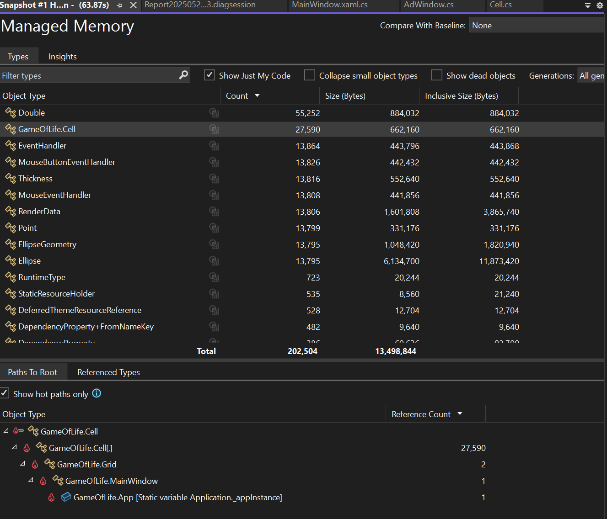
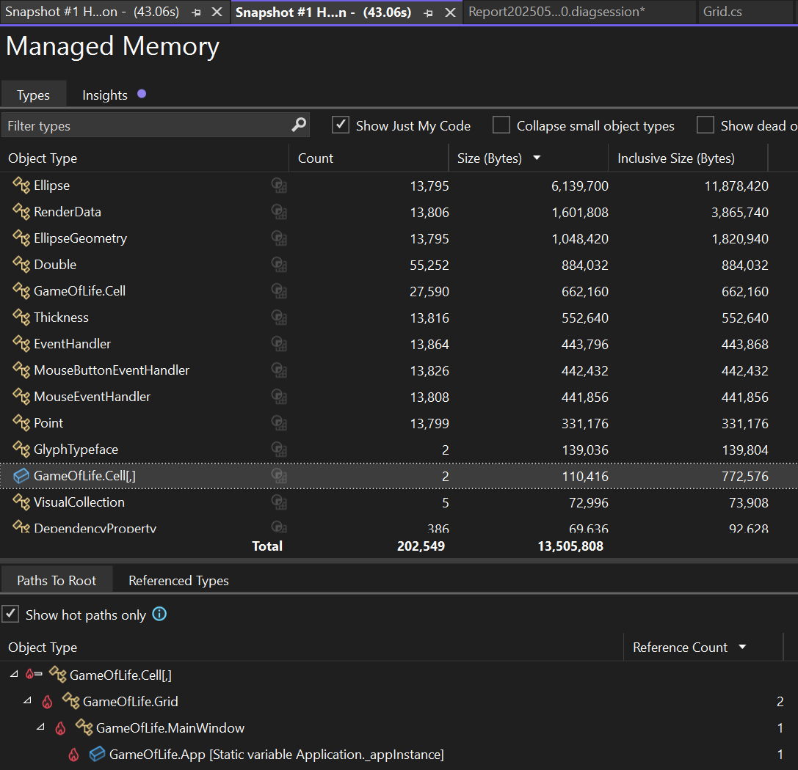

# Task 3 - Game of Live

I used the Visual Studio 2022 tool called Performace Profiler I and got this information



You can notice a lot of memory allocation from different handlers and especially from the GameOfLife.Cell objects, so if we review the Cell class we notice an anemic domain model that contains a hard-coded constant ‘5’ whose meaning we don’t yet know; we’ll try to figure that out later. Coming back to our main issue, since we have so many allocations we need to find where the Cell objects are being created, and I discovered that each time the Grid class generates the next generation, a new Cell instance is allocated—adding significant memory pressure. For now, let’s update the existing cells instead of creating new ones. To do that, we’ll modify the CalculateNextGeneration method in the Grid class and adjust the Cell class accordingly.

The main changes in the Cell class encapsulates the some of the most important logic on it, and provides semantics

```cs
namespace GameOfLife
{
    class Cell
    {
        public int PositionX { get; }
        public int PositionY { get; }
        public int Age { get; private set; }
        public bool IsAlive { get; private set; }

        public Cell(int row, int column, int age, bool isAlive)
        {
            PositionX = row * 5;
            PositionY = column * 5;
            Age = age;
            IsAlive = isAlive;
        }

        public void Die()
        {
            Age = 0;
            IsAlive = false;
        }

        public void IncreaseAge()
        {
            Age += 1;
        }

        public void Revive()
        {
            IsAlive = true;
            Age = 0;
        }
    }
}
```

The main changes to the Cell class encapsulate some of its most important logic and provide clearer semantics.

```cs
public Cell CalculateNextGeneration(int row, int column)
{
    var currentCell = cells[row, column];
    var nextGenerationCell = nextGenerationCells[row, column];
    bool isAlive = currentCell.IsAlive;
    int neighborsCount = CountNeighbors(row, column);

    if (isAlive && neighborsCount < 2)
    {
        nextGenerationCell.Die();
        return nextGenerationCell;
    }

    if (isAlive && (neighborsCount == 2 || neighborsCount == 3))
    {
        nextGenerationCell.IncreaseAge();
        return nextGenerationCell;
    }

    if (isAlive && neighborsCount > 3)
    {
        nextGenerationCell.Die();
        return nextGenerationCell;
    }

//......
}
```

We reduced memory allocation, as shown in the following screenshot



After refactoring the Grid and Cell classes, I have a few concerns:

- The Grid class has too many responsibilities, perhaps splitting its functionality into separate classes would be beneficial.

- Generation updates still run on the UI thread, we should move them off the UI thread once the application is in a more stable state.

- It might make sense to encapsulate the logic that decides whether a cell should revive, die, or age within the Cell class itself.

- We may not need two separate grids (one for current cells and one for the next generation), but I’m not sure.